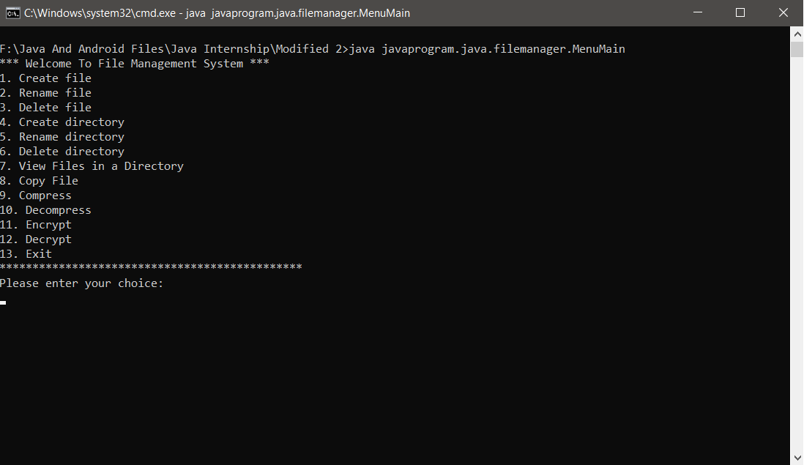

# Java Based File Management System:

### Overview:-
*I have coded these java file management when I was doing the internship.It is the menu driven file management system.*

### Compilation:-
*EncryptDecrypt
FileUtility
MenuMain*

*by using*

*javac -d . EncryptDecrypt.java
javac -d . FileUtility.java
javac -d . MenuMain.java*

*then run by*

*java javaprogram.java.filemanager.MenuMain*

### Note : if you are inserting the file in cmd kindly insert the path as c:\\filename.extenstion
